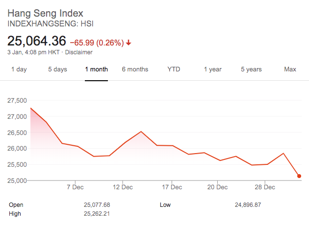

# Level 3 challenge: Stock Market Chart (optional)

This aim of this task is to build an application with both front end and a back end.

Stock market data can be retrieved through [Alpha Vantage](https://www.alphavantage.co/). Here is an [example](https://www.alphavantage.co/query?function=TIME_SERIES_MONTHLY&symbol=MSFT&apikey=demo).

You may use any alternative APIs for the data of stock markets.

The primary task is to input the stock code, for example, AAPL, then retrieve data from backend server, which caches data to reduce the number of API requests.

Once the data available in the front end, draw a chart to show the data, it can be as simple as a line chart, like in Google Search:

Here are the requirements:

1. Use either [Vue.js](https://vuejs.org/) + [Vuex](https://vuex.vuejs.org/) or [React](https://reactjs.org/) + [Redux](https://redux.js.org/), and you **MUST** use [webpack](https://webpack.js.org/) or any equivalent front-end building tools

1. Backend can be either [Node.js](https://nodejs.org/en/) ([Express](https://expressjs.com/) or [Koa](https://koajs.com/)) or Python ([Flask](http://flask.pocoo.org/))

1. API query result must be cached in database, and [MongoDB](https://www.mongodb.com/) is highly recommended, any database libraries of your language of choice can be used, for example, Mongoose, [monk](https://automattic.github.io/monk/) or [native MongoDB Node.js Driver](https://mongodb.github.io/node-mongodb-native/) for Node.js.

# Bonus:

Add any features that you think is useful, like comparing two stocks, or comparing a stock with a stock market index. We encourage you to utilize the empty space on screen.

Remarks: A well done bonus part can outweigh everything else!
